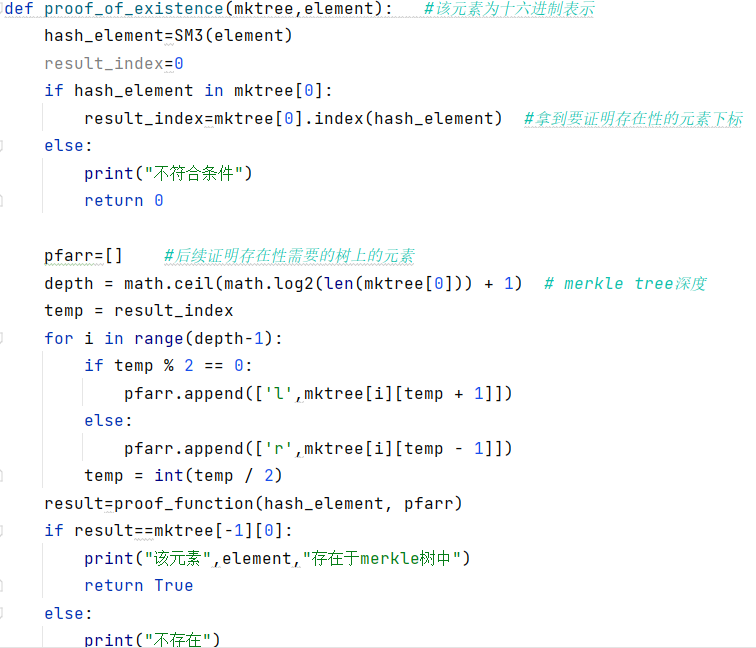

# Merkle Tree
## 项目简介

默克尔树的所有叶子节点，都用来存放数据。所有非叶子节点，都用来存放其所有孩子节点的内容的hash值。

基于这种数据存储方式，当任何叶子节点中的数据有变动时，其父节点内容也会变动，之后父节点的父节点也会变动，一直传递到根节点。

因此，默克尔树至少可以有如下两种用途：

1.快速比较大量数据

对要比较的两组数据分别构建默克尔树，最后比较两棵树的根节点是否相同，相同则数据相同。由于Hash计算的过程可以十分快速，预处理可以在短时间内完成。利用默克尔树结构能带来巨大的比较性能优势。

2.零知识证明  

存在性证明:  

如上图，通过构建上述一个默克尔树，你可以不向别人提供任何2的信息来向他们证明你拥有2,提供h3,h01,h45节点的值，则其他拥有2的人，就可以依据同样的规则生成ROOT节点，如果得出的结果和你提供的ROOT值相同，那么他就可以验证你确实拥有2。  

不存在证明:  

倘若SPV请求的目标交易并不在相应的块中，全节点应该怎么证明该目标交易并不在块的交易列表中呢?如果全部交易发过去让SPV节点一个个遍历比对，对于大区块结构区块而言，这种方案效率非常低。所以基于排序交易的不存在性证明的idea是:，先让目标交易与Coinbase交易比对，如果不相等，再去与排序后的交易中比对，找到最大的小于目标交易的交易，记为pre,最小的大于目标交易的交易，记为next。通过证明pre与next在排序后交易列表里位置相邻(中间不存在其他节点)，并且都可以验证其在相应的block中(即有Merkle Tree Inclusive Verifacation)，从而可证明目标交易并不在block的交易列表中。
## 项目说明
### 生成数据

### 生成merkle树

### 该函数为可以计算给定的一支的hash值

### 存在性证明

### 不存在证明

## 实验结果
